<h1 align="center">Hi 👋, I'm abh80</h1>

<h3 align="center">I am a Javascript / Java / C# developer</h3>

- 🔭 I’m currently working on **[Frontier](https://github.com/CosmoFrontier/Frontier)**

- 🌱 I’m currently learning **Nothing**

- 💬 Ask me about **react , angular**

- ⚡ Fun fact [**I like sleepless nights song!**](https://open.spotify.com/track/4PUWpNtDejQwwa80LjvxXl?si=0ac3c01d2a994967)

- My favourite language is **Java , Kotlin** 

<h3 align="left">Connect with me:</h3>

<h3 align="left">Languages and Tools:</h3>

                    

&nbsp;

